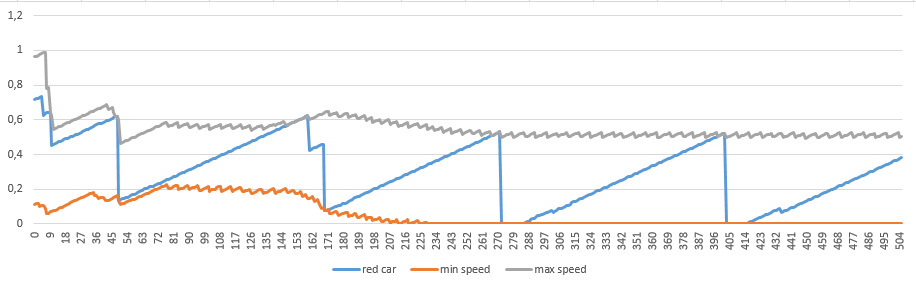

## СПм-08-1, Іващенко Г.С.  
---
## Імітаційне моделювання комп'ютерних систем
### Лабораторная работа №1. Описание имитационных моделей
---
### [Traffic Basic](http://www.netlogoweb.org/launch#http://www.netlogoweb.org/assets/modelslib/Sample%20Models/Social%20Science/Traffic%20Basic.nlogo)

### Вербальное описание модели
В симуляторе имеется однополосная дорога с односторонним движением, по которой один за одним едут автомобили. С разной скоростью, но обгонять не могут - вот и получается, что иногда выходит ползущая пробка: если одна машина сбросила скорость, то едущие следом также должны замедлиться, чтобы не врезаться.

### Управляющие парметры модели

### Внутренние парметры модели
### Критерии эффективности работы модели

### Вычислительные эксперимнты
Эксперименты служат для проверки выдвинутой гипотезы, или в процессе изучения влияния того или иного параметра на работу модели (а значит, и объекта). И в рамках гипотезы у нас описывается и использование модели, её настройка.

#### Гипотеза 1. 
Исходное положение автомобилей при запуске симуляции на среднее время прохождения трассы не влияет. Пять запусков симуляции с одними и теми же параметрами, фиксация значения средней скорости "красной машины".

#### Гипотеза 2.
Изучить влияние загруженности дороги на среднюю скорость её проезда. Т.е. сделать ряд прогонов модели, ставя разное число число машин на трассе с некотррым шагом. И построить в экселе график зависимости.

#### Гипотеза 3.
Изменение скорости торможения не влияет на среднюю скорость перемещения по трассе. И тут же можно проверить, что и ускорение - повлияет ли? Вот мне кажется, что гораздо сильнее повлияет именно ускорение.

<table>
  <thead>
    <tr>
      <th>Торможение</th>      
      <th>Средняя скорость</th>
    </tr>
  </thead>
  <tbody>
    <tr>
      <td>0.1</td>      
      <td>0.222</td>
    </tr>
    <tr>
      <td>0.2</td>      
      <td>0.222</td>
    </tr>
    <tr>
      <td>0.3</td>      
      <td>0.222</td>
    </tr>
    <tr>
      <td>0.4</td>      
      <td>0.222</td>
    </tr>
    <tr>
      <td>0.5</td>      
      <td>0.222</td>
    </tr>
  </tbody>
</table>

